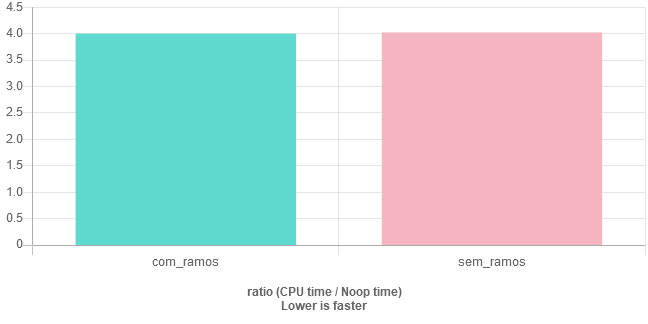
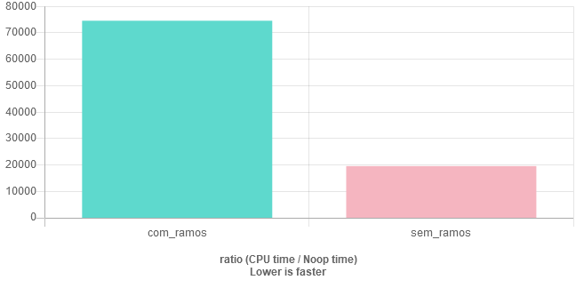
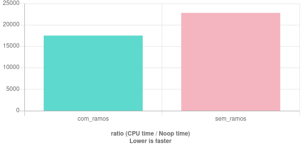

# Programação sem IF e ELSE?

<!-- subtítulo: Não tente isso na produção -->
<!-- subtítulo: Tente com a supervisão de um adulto -->

Já pensou escrever um programa **inteiro** sem `if`s ou `else`s ? Provavelmente não, mas isso não significa que não podemos fazer lógica sem eles, e às vezes bem mais **rápido**.

O nome desse tipo de programação é `branchless programming` (programação sem ramos), já que não usa `if`, que criaria **ramos de execução** para o código.

***Por que isso seria útil?***

No seu caso, provavelmente, só serviria para satisfazer a curiosidade. Mas em casos específicos, como **código criptográfico**, esse tipo de programação é absolutamente requerido, já que a existência de dois possíveis caminhos poderia resultar em tempos de execução **diferentes** para determinadas entradas que, por sua vez, causaria o **vazamento** de informações sigilosas. Nesse caso, programação `branchless` é usada como **medida de segurança**!

Outro uso legítimo é em determinados algoritmos de baixo nível que não podem **desperdiçar** o tempo que o `if` custa, dessa forma, o `branchless`, teoricamente, serve para deixar o programa **bem** mais **rápido**. Mas preste bastante atenção se quiser usá-lo para aumentar a performance: seu compilador é muito mais **esperto** do que você. Grandes são as chances que ao aplicar esse tipo de programação, ao invés de deixar seu programa mais rápido, não vai alterar a performance, ou até pior, vai deixá-lo mais **devagar**. Lembre-se: "otimização prematura é a raiz de todo o mal" (David Knuth). 

***Então como saber se posso usar programação `branchless` para acelerar meu algoritmo?***

A melhor forma é programar dos dois jeitos e medir a **performance** deles em uma situação parecida com aquela na qual serão usados. Por outro lado, para evitar todo esse trabalho, entender o porquê do `if` ser considerado tão devagar pode te ajudar a determinar se ele é um possível problema. Se sim, aí você pode colocar a "mão na massa" e calcular se o `branchless` vai te ajudar.

### *Por que o if é tão devagar*?

As CPUs modernas tem alta capacidade de **paralelização**, isto é, ao invés de executar **uma instrução** de cada vez, elas pegam as próximas linhas de código e decidem o que podem fazer **ao mesmo tempo** sem interferir no resultado final. Para que esse tipo de paralelização seja mais efetiva, o caminho de código tem que conter o **menor número** de ramos **possível**. Mas, como sabemos, não é assim que a maior parte de código é. Tem '*if*' daqui, '*else*' de lá, '*switch*' dentro de *loop* e assim vai. Sabendo disso, os desenvolvedores de processadores criaram outro mecanismo para auxiliar o primeiro: o *branch predictor* (preditor de ramos), que tem a capacidade de **prever** qual dos ramos vai ser tomado antes mesmo de computar o resultado. Eles são excelentes, de verdade, com precisão de cerca de 95%, mas não são perfeitos. Assim, quando eles acertam, o `if` tem um custo quase **zero** na execução, porém, quando erram...

Já que o preditor de ramos é a base para o funcionamento da execução **paralela da CPU**, quando ele erra, todo o trabalho feito pelo outro ramo durante a paralelização tem que ser **desfeito** e as instruções certas tem que ser buscadas, para então o ramo correto ser executado. Como eu disse, isso quase não acontece, já que o preditor de ramos é muito bom, mas existem certos algoritmos que dificultam muito o trabalho dele. Por exemplo, uma função `min(a, b)` que determina qual o **menor número** entre `a` e `b`, normalmente, vai ser usada em números que tem 50% de probabilidade de cada um ser o **maior**.

```cpp
// A vai ser menor cerca de metade das vezes
int min(int a, int b) {
	if (a < b)
		return a;
	else
		return b;
}
```

Nesse caso, o preditor de ramos não faz ideia de o que fazer e vai errar metade das vezes, o que resultaria em muito tempo gasto. Esse caso levantaria a suspeita de que uma abordagem `branchless` poderia **aumentar** a performance.

### Aplicando programação branchless.

A programação sem ramos tem como base o fato de que o computador representa valores verdadeiros e falsos com os números 1 e 0, o que permite aplicarmos aritmética a eles. Dessa forma, se temos **dois possíveis** cálculos a fazer e precisamos decidir entre eles com base em alguma condição, ao invés de usarmos:

```
if (condicao):
	calculo1()
else:
	calculo2()
```

Uma abordagem '*branchless*' seria:

```
calculo1()*condicao + calculo2()*(!condicao)
```

Ou seja, você **multiplica** o primeiro cálculo pela **condição** e o **segundo** cálculo pelo **inverso da condição** e soma. Isso funciona por que multiplicação por **verdadeiro** (um) resulta no **próprio cálculo**, ou seja, mantém ele e multiplicação por **falso** (zero) resulta em zero.

Se aplicarmos à função `min()` de antes, ela poderia ser assim:

```cpp
// A vai ser menor cerca de metade das vezes
int min(int a, int b) {
	return a * (a < b) + b * !(a < b);
}
```

Agora, se deixarmos **mais rápido**, só vamos saber se medirmos a **performance**. Não vou entrar a fundo nisso, mas os resultados em uma **compilação otimizada** (O3) são esses:



***Como assim?? Achei que programação sem ramos era pra ser mais rápida!***

Pois é, como eu disse antes: seu compilador é muito **esperto**. Ele conseguiu perceber nos dois casos o que estávamos tentando fazer (retornar o menor dentre dois números) e disse: "Opa, eu sei um jeito mais rápido de fazer isso", então ambos foram **compilados** para o mesmo **código** de máquina. Se você não acredita, pode tentar repetir o *benchmark*. Tá aqui o código e funciona [nesse](https://www.quick-bench.com) site:

```cpp
// A vai ser menor cerca de metade das vezes
int min_com_ramos(int a, int b) {
	if (a < b)
		return a;
	else
		return b;
}

// A vai ser menor cerca de metade das vezes
int min_sem_ramos(int a, int b) {
	return a * (a < b) + b * !(a < b);
}

static void com_ramos(benchmark::State& state) {
  int i = 0;
  for (auto _ : state) {
    ++i;
    int a = i;
    int b = a + (i%2)*(-2) + 1;

    int res = min_com_ramos(a, b);
    benchmark::DoNotOptimize(res);
  }
}
BENCHMARK(com_ramos);

static void sem_ramos(benchmark::State& state) {
  int i = 0;
  for (auto _ : state) {
    ++i;
    int a = i;
    int b = a + (i%2)*(-2) + 1;

    int res = min_sem_ramos(a, b);
    benchmark::DoNotOptimize(res);
  }
}
BENCHMARK(sem_ramos);
```


Os casos que *branchless* realmente leva a algum ganho na performance são muito específicos. O melhor mesmo, ainda mais se você for iniciante, é confiar que seu compilador vai fazer essas micro otimizações por você e se concentrar em usar as melhores **estruturas** de dados e **algoritmos** para cada ocasião e tentar usar algo como [design orientado à dados](https://moskoscode.com/o-super-veloz-design-orientado-a-dados/) quando possível.

Com esses avisos fora do caminho, vamos ver um caso muito legal que programação *branchless* realmente consegue aumentar a performance!

***Você já digitou seu nome de usuário em algum site, mas, incomodamente ele não conseguiu identificar por que você colocou alguma letra maiúscula? Um saco, né?***

A função que vamos fazer poderia ter sido usada para evitar esse erro. É uma função `para_minuscula(char* str)` que transforma letras **maiúsculas** em **minúsculas** sem afetar o restante dos caracteres. O jeito mais simples de implementar isso seria:

```cpp
void para_minusculas(char* texto) {
	// Faça até chegarmos no fim da string
    for (; *texto != '\0'; ++texto) {
    	// Se o caractere for uma letra maiúscula
        if (*texto >= 'A' && *texto <='Z') {
        	// Transforme ela em minúscula
            *texto += 'a' - 'A';
        }
    }
}
```

Como você pode ver, temos um ramo que opera se o caractere for uma letra maiúscula, outro quando não for. Se qualquer caractere do ASCII for considerado uma **entrada válida**, a probabilidade de cada ramo é de aproximadamente 20% para letras maiúsculas e 80% para outros - uma chance baixa de acerto para o prevedor de ramos. Ao mesmo tempo, também parece ser uma função complexa o suficiente para que o compilador não consiga **otimizar totalmente**. Uma ótima candidata para tentarmos aplicar programação *branchless*. Ficaria assim:

```cpp
void para_minusculas(char* texto) {
	// Faça até chegarmos no fim da string
    for (; *texto != '\0'; ++texto) {
        // se for uma letra maiúscula transforme-a em minúscula
        *texto += ( (*texto >= 'A' && *texto <='Z') * ('a' - 'A') );
    }
}
```

E rufem os tambores....




Quase 4x **mais rápido** do que a versão com ramos! Isso que é um raminho de nada, imagina se fosse algo super rebuscado.

Só que ainda tem um "porém": **programação *branchless*** só aumenta a velocidade se os ramos forem **imprevisíveis** na maior parte do tempo. Se você olhar o texto que eu uso como entrada para o programa, tem a caixa (alta ou baixa) dos caracteres randômica. Em um texto com uma quantidade normal de letras maiúsculas e minusculas o resultado é esse:



Doido, né? O `sem_ramos` tem o tempo de execução quase igual, enquanto o `com_ramos` foi lá pra baixo. Isso é porque, no segundo caso, os ramos são bem mais **previsíveis** e a CPU consegue adivinhar qual vai ser tomado e por isso teve menos trabalho no total. Esse é o código do *benchmark*, se quiser testar:

```cpp
#define TEXTO_RANDOMICO R";(lOrem IpSUm dolOR SIT aMet, cOnsECteTur adipISCIng ElIt. praesenT suSCIpit liGUlA ET ANTE cONSEQuAT AlIqUET. NAm esT oRcI, Cursus SEd DaPIbUS Vel, PrEtIUM AC ESt. PhASELLUs RUTRUm ET NeQue Nec SolLIcItUDIn. AliqUAM EU ORcI maTTIs, VeNenAtIs dUi EGET, acCUMSaN ErAT. phAsELluS UltricIes Est QuIS eX aCCuMsAn RHoncUS. NuLLaM lAcUS Erat, aUcToR iD bibEnDUM ut, rhOncus Id eX. etiAM FEUGiat sEM NoN rIsus LuctUs fAUCIbUs. ETiAm mOlESTie NiSL Nibh, sOllICituDIN AlIQUaM nISi ulTriCES Ut. sEd EuisMoD TEMPOR ElIt Ut temPUS. PraEsENT hENdReriT doloR iN eFFICiTUR eLEMEntuM. proIn QUAm nuLlA, uLlamcORPer VITAE COMmoDO IN, AccuMSAn pREtium AntE. Sed poSueRE MOlestIe maUrIs nEC vESTibUlum. AliqUaM TriStiqUE CondiMenTUm lecTus, mOLEstiE ULtrIciEs MAuRis PELLentEsQue Nec. DuIs UltRiCeS, metUS iACULis FAUCiBUs tEmpuS, RisUS TORtor POsUeRE oDIo, aT OrnaRe NiSL LigulA quIs maSSa. EtiaM IN nISI sem. EtIAm sCelErIsque eros ViTAE MetuS PeLLENtesqUe sodAlEs.dOnEC nec MaGNA nec orcI feUGIat FaCIlIsIS. sED PLACerAT NUlLA QuAm, SeD luctus ErOS coNVAlLis veL. seD iD vEhiCUla sAPIen, sIT amet VOLUtpaT TeLlus. fUsce at ex NiBH. mOrBI oDio dUI, DictUm eU puruS NEC, CoMmoDo poRTA MASsa. eTiAM lObORTIs a turpis uT LaOREEt. QuiSQUE fiNIBUS odIO MI, VEL VOlUTpat est VUlPUtaTe VEl. curABItUR A RISUS In Nulla elEiFEND lOBorTiS. pRaesent NEc oRnare DUi. mAURIs vEneNaTiS vEstIBuluM METUs. veStIBUlum sED MauriS LUCTUs, SEMpeR mEtuS uT, UllAMcoRpER eraT. VEsTIBuLUM BLanDit Et TURPiS In EuiSMod.Sed pUlvINar, mAURIS CURSUS ELEifeND mOLesTIE, arcU DOlor FErMeNTUM elIT, eU POsuErE tUrPIs IPSuM VEl puruS. vIVAmUS VEl TEmPuS NuLlA, uT euismoD velIt. mAUrIs eT NISl nEC veliT malEsUADa laOREeT vel nON eraT. cras nON MaSSa nulLA. in IN mAXimus odio. SED EfFIciTUR, pUrUS NeC iaCULiS SempEr, veLIt nIbH MaxiMUS LaCus, Eu TEMpUs IpSUM eLit nec LoREm. doNEc VOlUTPAt IAcULIs eleMEnTum. iN rISus saPien, MOlliS soLLICITudiN rHoNCuS vEL, pulviNAr EgEt lOReM. mAuRiS iD aCcUmSAN mAGNA, vEl BibEnduM erAT. aEnEAn mEtus Eros, EfficiTUR et quaM egET, GRAVIda tInCiDUNT mAGna. Nunc eU EnIM massA. VIVAMuS MaLesUadA rIsUS NOn pUrUS ULtRICIes, At pHAretra ODio DIgnIsSIM. NULlam in urna DOlOr. SEd tRiStIQue hEnDrERit lECtus, at MaTtiS augUe suSciPiT vitAE.vesTiBUlum pULvINaR lEctuS Et DOLOr volUTPaT IMperDIet. sed PulviNAR lobOrtIs LuctuS. DoNec RuTRuM TUrPIS ut DiCtum RUtRum. aLiQUAM SusCipIt NULLa erOs, Non SAGittis liBERo DicTuM Quis. PelleNtESqUE sAGiTTIS iNteRdum ErAT, AT FEUGiAT DoLor FAUCIbUS SeD. pELlentEsQUE QuiS enIm DIcTUM, ORnARe MASSa TeMPUS, pHARetra Elit. VIvAMUs PULVInar, NIsl VEL IACUlIs eUISmOd, oDiO SapIEn HEndReRIt MaGNA, A DicTUM felis liguLA SiT aMeT puruS. MAURis VulpUtATE VeLit ET LEo acCUmSAn HENDRErit Id a nULla. Lorem iPSUM DoloR SIT amET, cOnSectEtur adipISCINg ELiT. NUllAm puLviNaR erAT rISUs, nec FRiNGilLA DolOR VolutPAt SodALEs. PRoIn sAGITTiS TurPiS LigUlA, Nec porTTItor sEM imPeRDIET sUscIpit. sEd iN EroS DUI. aENEan Eu MOLlIS arcU, VITaE pReTiuM Nibh. MAUrIs Nunc magna, imperdiET AT qUam uT, viVeRRa CoNDimENtUM nUlLa. VesTIBulUm VeNENatiS, RISuS a RHOnCUS IAcuLis, mAssa DIaM Efficitur URNA, AT sCeleRIsquE sAPieN ex ET esT. nullAm in tellUs feLIS.quISque at niSI ArcU. pHaSELlUs neC magna NOn urNa PULvINar DICTuM. vESTibulUm AlIQuet mAURIS Et faCiLISIS IMpERdiet. Sed UlTriciEs MOLeSTiE NIsi, EGEt alIqUeT tURpis TinCIDunT id. PrOiN ac mETUs aC DIAm bibEnduM SODalES. donec felIS ligulA, susCipit siT ameT RUtrUM A, ORNARE nEc lectuS. SEd sit AMet MAGna MAlEsUaDa, ACCUMsAN lIgula Ac, ConvaLlIS leCTuS. SEd bIbeNDUm cOnsEctetUR URna coNvALLIS sCElEriSque. Sed at oRci MEtus. vESTibulum AnTE ipsUM prIMis In FaUCiBus orcI LUctuS eT uLTRIcES POSUEre cubilIa cuRaE; uT ET lIBeRO mAssa.nUllAm tristIQue aCcUmSaN nulLA At uLlaMcOrpER. In vestibuluM fRingIllA LAcUS, AC cOmmoDO veLIT COnDIMenTUM id. Ut neC eSt est. NuNc Id odIo aC FELiS prEtIUm cursuS. dONeC dIctuM LAoREeT RISuS, quis ELEIfeNd nuLlA feRmeNTum id. CRAs LIbERO METus, VEnenatiS siT amEt meTUs Eu, sUSCIPIt GrAvIda teLlUS. ETIAm Ut TInCidunt MEtuS, A FinIBUs MAGnA. nuLLAm at Posuere LACUs. nAm ALiQUAm PorTA LEcTus, SED semPEr nEqUE sodAlEs vEl. In ViTAe PlAcerAT Justo. eTiaM VeL ENiM sIT AmeT ODIO blANdit PoRtTItoR uT Ut urnA. PHAseLlus VARiuS conSeQuAt LIbero, qUiS fEugIAT ARcU trIstIquE NEC. vEstiBulUM pElLENtESque VElIT EGeT eLIT aLIQuAM iACuLIs. in eu aUGuE vITae eLiT TeMPus CONsEQuaT VEl AC MaURIs. cUraBiTur ID ipsUm fRINGILla, MOLLIS nunc eu, bIBENdUM eNim. MAURis ferMENtUm, ARcU vel ALiQuaM SCElErIsQue, esT VeliT cONgUe SEM, A SODaLES SeM lACUS COnSeqUAt ErOSCurABItUr MI AugUe, PORTA nec VeLIT at, MAleSUAda SCELERisQUE NEQUe. CRAs vel nUlLa FrinGilLa ODiO aliQuam plAcerAT A QUIs ESt. pRAEsenT vEl PORta jUsTo, AT fEUgiat tortOR. VesTibuluM PURUs LOrEm, PuLVInaR EU UrNa IMpERDiEt, eleifEnD PuLVINar DUI. CRAs rUtrum effIciTUr eGEstas. VesTIbulum blandIt SApIEN lacUS, UT MALeSuAdA JustO PoSUeRe aC. NULLaM VEL AUGuE heNdrerit, MalESUAdA dUi non, ULLamCORper Mi. sED SeD PlACERat FELIS. dUIS IN MalesUAda AnTE. iNtegeR InTErDuM nEc nISl aC CONSeqUat.eTIAm Fermentum ErAT vITAe PeLLenTESQUe dIgnISSiM. nUnc UT LECTUS InTeRDuM, MoLLIs LEo NEc, VESTIBUlum EniM. donec Mauris iPSuM, auCtOr iD ConSEQUAT noN, mALeSuADA VEl niSi. ETIAm MOLEStIe lORem a neqUE peLLenTESQUE TincIDUNT. Phasellus PREtIum eFficItUr urNA, SEd uLtRiCeS NIBh SceLErISQuE soLliCitudiN. in VEl aUctOr VEliT. cRAS PHArETra euiSMOD poSuere. sUSpEndiSsE eT voLutPAt nisL. inteGer SEM NIsl, PlaCErAt Nec Lacus Id, pElLeNTesque pOrtA RiSus. qUisquE eFfiCiTur LACUS Vel mi LAcinia vesTiBuLUM. MorbI FINIBUs DaPiBUs mAssA, finiBus SolLiCiTUdin URna fINibUs UT.sUspeNDiSse bLaNDIt LIBERO Et TElLUS CONvaLLIs, EU PrETiUm meTus FeRmeNTuM. MAuriS Ac NIbh DiaM. NulLa accuMsan LAcuS quiS luctUS tincidunt. VEsTibuluM EROs vElIT, posUerE MALESUaDa ULTRiCIeS ut, TrIsTiqUe NoN PuRuS. naM AUctoR LeCTUs mAssA, pLacErAT ComMOdo urnA DIGnISSiM iD. iN hac HabItASsE pLateA DiCtumSt. eTiAM vEsTiBUlum TEMPoR SEmpeR. ETiAM SIT AmEt sEm ElEifenD, lACinia LIGula SEd, luCtuS LIberO. nunc ac ornare juSto. dUIs veL CONDiMeNtUM erAt, NoN ruTrUM RiSuS. fusCe Risus Lacus, VolUTPAT Ac AlIQUAm aT, dictum veL tELLus. DUIS maURIs NunC, SodAlES LaCinIA RUtRUM aC, AUCTor Et nUlLA. MAurIS rUtRum, eNiM aC VivERRA cOnseQUat, NunC FeLiS ELemENTum lIguLa, nEC aUcTor anTE DoLoR iN ARcu. PrOiN coNdiMENTum poSueRe TOrtor At PULVINAr. Nam TemPUS Mi ut RhoNCus ConVaLlis. VEstIBUlUm aC LIBeRo In eRaT cONVAllis VoLuTPaT NeC sAGiTtiS AUguE.PrOin DIAm urNA, egEstas IN LEo Ut, PelLEntesquE DAPIbus NUlLa. pEllEnTEsqUe iacUlIs cursUS lACUS, eu coNgue erAt SCeleRISQue quis. duiS Massa OdiO, acCUMSAn vel antE Sed, tIncIDuNt varius RIsuS. vesTibULUm AnTe iPSUm primIs in fAucIBUs orCI LUCTUS ET ULTRIces pOSuere CUBILIA CUrAE; UT nec ligULA A tuRPIs temPUS VenEnATis nON sed lectUs. sED VEL DOloR pHAreTra, ALiQUeT urna NOn, feUGiAt fELIS. SEd et loBoRTIs LectuS. NUllAM fACIlisIS eX NEC MALeSuaDa FACILIsis. dOnec cOnVALlIS vELIt SUScIPiT mOLeStie MaxImUs. FuSCE GrAViDA sCeLERiSQue elit, Nec coNvallis urna cOmModO Ac. duiS COMModo ORnArE PURuS, Ac dApiBus nuNc CursuS nOn. UT tINCIDunT Sem At teMPUS vEhiCULa. curaBitUr DIGNiSsIm fAuCibUs BibEnDUm. iN cONgue, tuRPiS a TiNCiDUNT ConSeCTEtur, MAURIS leCTUs PORtA jUsTo, NON AliqUeT risUs nisL viTAe vElIt. donec tIncIDuNt dOlor EU MeTUS UllAmCoRpEr SEMper. );"
#define TEXTO_NORMAL R";(Lorem ipsum dolor sit amet, consectetur adipiscing elit. Praesent suscipit ligula et ante consequat aliquet. Nam est orci, cursus sed dapibus vel, pretium ac est. Phasellus rutrum et neque nec sollicitudin. Aliquam eu orci mattis, venenatis dui eget, accumsan erat. Phasellus ultricies est quis ex accumsan rhoncus. Nullam lacus erat, auctor id bibendum ut, rhoncus id ex. Etiam feugiat sem non risus luctus faucibus. Etiam molestie nisl nibh, sollicitudin aliquam nisi ultrices ut. Sed euismod tempor elit ut tempus. Praesent hendrerit dolor in efficitur elementum. Proin quam nulla, ullamcorper vitae commodo in, accumsan pretium ante. Sed posuere molestie mauris nec vestibulum. Aliquam tristique condimentum lectus, molestie ultricies mauris pellentesque nec. Duis ultrices, metus iaculis faucibus tempus, risus tortor posuere odio, at ornare nisl ligula quis massa. Etiam in nisi sem. Etiam scelerisque eros vitae metus pellentesque sodales.Donec nec magna nec orci feugiat facilisis. Sed placerat nulla quam, sed luctus eros convallis vel. Sed id vehicula sapien, sit amet volutpat tellus. Fusce at ex nibh. Morbi odio dui, dictum eu purus nec, commodo porta massa. Etiam lobortis a turpis ut laoreet. Quisque finibus odio mi, vel volutpat est vulputate vel. Curabitur a risus in nulla eleifend lobortis. Praesent nec ornare dui. Mauris venenatis vestibulum metus. Vestibulum sed mauris luctus, semper metus ut, ullamcorper erat. Vestibulum blandit et turpis in euismod.Sed pulvinar, mauris cursus eleifend molestie, arcu dolor fermentum elit, eu posuere turpis ipsum vel purus. Vivamus vel tempus nulla, ut euismod velit. Mauris et nisl nec velit malesuada laoreet vel non erat. Cras non massa nulla. In in maximus odio. Sed efficitur, purus nec iaculis semper, velit nibh maximus lacus, eu tempus ipsum elit nec lorem. Donec volutpat iaculis elementum. In risus sapien, mollis sollicitudin rhoncus vel, pulvinar eget lorem. Mauris id accumsan magna, vel bibendum erat. Aenean metus eros, efficitur et quam eget, gravida tincidunt magna. Nunc eu enim massa. Vivamus malesuada risus non purus ultricies, at pharetra odio dignissim. Nullam in urna dolor. Sed tristique hendrerit lectus, at mattis augue suscipit vitae.Vestibulum pulvinar lectus et dolor volutpat imperdiet. Sed pulvinar lobortis luctus. Donec rutrum turpis ut dictum rutrum. Aliquam suscipit nulla eros, non sagittis libero dictum quis. Pellentesque sagittis interdum erat, at feugiat dolor faucibus sed. Pellentesque quis enim dictum, ornare massa tempus, pharetra elit. Vivamus pulvinar, nisl vel iaculis euismod, odio sapien hendrerit magna, a dictum felis ligula sit amet purus. Mauris vulputate velit et leo accumsan hendrerit id a nulla. Lorem ipsum dolor sit amet, consectetur adipiscing elit. Nullam pulvinar erat risus, nec fringilla dolor volutpat sodales. Proin sagittis turpis ligula, nec porttitor sem imperdiet suscipit. Sed in eros dui. Aenean eu mollis arcu, vitae pretium nibh. Mauris nunc magna, imperdiet at quam ut, viverra condimentum nulla. Vestibulum venenatis, risus a rhoncus iaculis, massa diam efficitur urna, at scelerisque sapien ex et est. Nullam in tellus felis.Quisque at nisi arcu. Phasellus nec magna non urna pulvinar dictum. Vestibulum aliquet mauris et facilisis imperdiet. Sed ultricies molestie nisi, eget aliquet turpis tincidunt id. Proin ac metus ac diam bibendum sodales. Donec felis ligula, suscipit sit amet rutrum a, ornare nec lectus. Sed sit amet magna malesuada, accumsan ligula ac, convallis lectus. Sed bibendum consectetur urna convallis scelerisque. Sed at orci metus. Vestibulum ante ipsum primis in faucibus orci luctus et ultrices posuere cubilia curae; Ut et libero massa.Nullam tristique accumsan nulla at ullamcorper. In vestibulum fringilla lacus, ac commodo velit condimentum id. Ut nec est est. Nunc id odio ac felis pretium cursus. Donec dictum laoreet risus, quis eleifend nulla fermentum id. Cras libero metus, venenatis sit amet metus eu, suscipit gravida tellus. Etiam ut tincidunt metus, a finibus magna. Nullam at posuere lacus. Nam aliquam porta lectus, sed semper neque sodales vel. In vitae placerat justo. Etiam vel enim sit amet odio blandit porttitor ut ut urna. Phasellus varius consequat libero, quis feugiat arcu tristique nec. Vestibulum pellentesque velit eget elit aliquam iaculis. In eu augue vitae elit tempus consequat vel ac mauris. Curabitur id ipsum fringilla, mollis nunc eu, bibendum enim. Mauris fermentum, arcu vel aliquam scelerisque, est velit congue sem, a sodales sem lacus consequat eros.Curabitur mi augue, porta nec velit at, malesuada scelerisque neque. Cras vel nulla fringilla odio aliquam placerat a quis est. Praesent vel porta justo, at feugiat tortor. Vestibulum purus lorem, pulvinar eu urna imperdiet, eleifend pulvinar dui. Cras rutrum efficitur egestas. Vestibulum blandit sapien lacus, ut malesuada justo posuere ac. Nullam vel augue hendrerit, malesuada dui non, ullamcorper mi. Sed sed placerat felis. Duis in malesuada ante. Integer interdum nec nisl ac consequat.Etiam fermentum erat vitae pellentesque dignissim. Nunc ut lectus interdum, mollis leo nec, vestibulum enim. Donec mauris ipsum, auctor id consequat non, malesuada vel nisi. Etiam molestie lorem a neque pellentesque tincidunt. Phasellus pretium efficitur urna, sed ultrices nibh scelerisque sollicitudin. In vel auctor velit. Cras pharetra euismod posuere. Suspendisse et volutpat nisl. Integer sem nisl, placerat nec lacus id, pellentesque porta risus. Quisque efficitur lacus vel mi lacinia vestibulum. Morbi finibus dapibus massa, finibus sollicitudin urna finibus ut.Suspendisse blandit libero et tellus convallis, eu pretium metus fermentum. Mauris ac nibh diam. Nulla accumsan lacus quis luctus tincidunt. Vestibulum eros velit, posuere malesuada ultricies ut, tristique non purus. Nam auctor lectus massa, placerat commodo urna dignissim id. In hac habitasse platea dictumst. Etiam vestibulum tempor semper. Etiam sit amet sem eleifend, lacinia ligula sed, luctus libero. Nunc ac ornare justo. Duis vel condimentum erat, non rutrum risus. Fusce risus lacus, volutpat ac aliquam at, dictum vel tellus. Duis mauris nunc, sodales lacinia rutrum ac, auctor et nulla. Mauris rutrum, enim ac viverra consequat, nunc felis elementum ligula, nec auctor ante dolor in arcu. Proin condimentum posuere tortor at pulvinar. Nam tempus mi ut rhoncus convallis. Vestibulum ac libero in erat convallis volutpat nec sagittis augue.Proin diam urna, egestas in leo ut, pellentesque dapibus nulla. Pellentesque iaculis cursus lacus, eu congue erat scelerisque quis. Duis massa odio, accumsan vel ante sed, tincidunt varius risus. Vestibulum ante ipsum primis in faucibus orci luctus et ultrices posuere cubilia curae; Ut nec ligula a turpis tempus venenatis non sed lectus. Sed vel dolor pharetra, aliquet urna non, feugiat felis. Sed et lobortis lectus. Nullam facilisis ex nec malesuada facilisis. Donec convallis velit suscipit molestie maximus. Fusce gravida scelerisque elit, nec convallis urna commodo ac. Duis commodo ornare purus, ac dapibus nunc cursus non. Ut tincidunt sem at tempus vehicula. Curabitur dignissim faucibus bibendum. In congue, turpis a tincidunt consectetur, mauris lectus porta justo, non aliquet risus nisl vitae velit. Donec tincidunt dolor eu metus ullamcorper semper. );"

void para_minusculas_com_ramos(char* texto) {
	// Faça até chegarmos no fim da string
    for (; *texto != '\0'; ++texto) {
    	// Se o caractere for uma letra maiúscula
        if (*texto >= 'A' && *texto <='Z') {
        	// Transforme ela em minúscula
            *texto += 'a' - 'A';
        }
    }
}

void para_minusculas_sem_ramos(char* texto) {
	// Faça até chegarmos no fim da string
    for (; *texto != '\0'; ++texto) {
        // se for uma letra maiúscula transforme-a em minúscula
        *texto += ( (*texto >= 'A' && *texto <='Z') * ('a' - 'A') );
    }
}

static void com_ramos(benchmark::State& state) {
  int i = 0;
  for (auto _ : state) {
    ++i;
    char texto[] = TEXTO_NORMAL;

    para_minusculas_com_ramos(texto);
    benchmark::DoNotOptimize(texto);
  }
}
BENCHMARK(com_ramos);

static void sem_ramos(benchmark::State& state) {
  int i = 0;
  for (auto _ : state) {
    ++i;
    char texto[] = TEXTO_NORMAL;

    para_minusculas_sem_ramos(texto);
    benchmark::DoNotOptimize(texto);
  }
}
BENCHMARK(sem_ramos);

```


Então essa é a moral da história: *branchless* **funciona**, mas só em casos que os ramos são **imprevisíveis** e o código é complexo o suficiente para que seu compilador **não consiga otimizar** por você.

Espero que você tenha aprendido uma coisa ou duas nesse post e até semana que vêm!

---

Gostou de aprender sobre isso? Quer aprender mais? 

Considere nos [apoiar no Catarse](https://www.catarse.me/moskoscode), avalie as [recompensas](https://www.catarse.me/moskoscode) e ajude a fortalecer o Moskos' Codefield!

Se quiser, se inscreva na nossa [newsletter](https://moskoscode.com/newsletter) e nos siga nas nossas [redes sociais](https://linktr.ee/moskoscode) para não perder novos posts como esse!

Se gostou, compartilhe! E até amanhã ;)

[Instagram](https://www.instagram.com/moskoscode)
[Facebook](https://www.facebook.com/moskoscode)
[Twitter](https://www.twitter.com/moskoscode)
